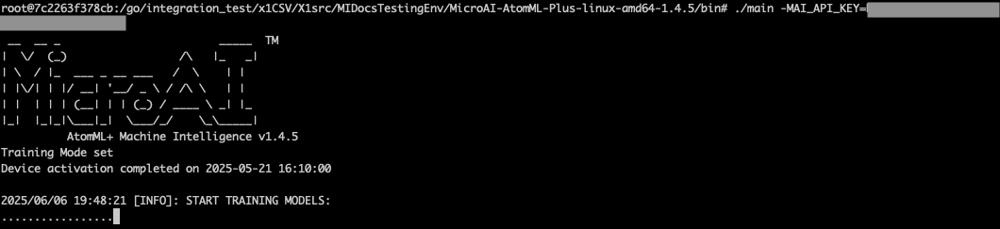
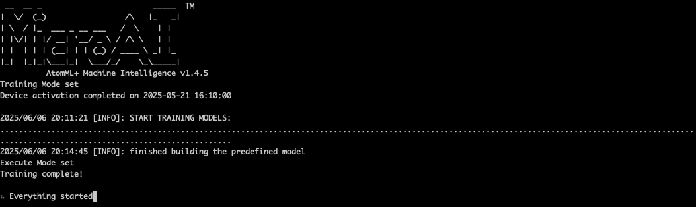
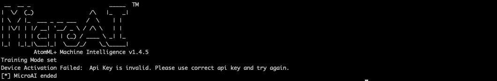
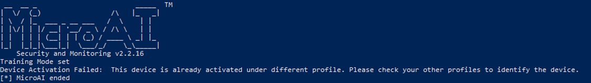

# Installation Walkthrough for Linux and Windows

In this section, we will walk through the installation process for a Linux environment and Windows environment.

## Launching MicroAI
Depending on your host hardware configuration, you may require advanced privleges to run Machine Intelligence.  The commands for linux and windows are listed below

#### Linux
```
sudo
```
#### Windows
```
runas /user:Administrator
```
The following screenshots illustrate an example of running MicroAI on Linux.

In the first screenshot, the agent is initialized and the device is activated, displaying the confirmation message: **"Device is activated successfully."** Once activated, the agent enters Training Mode, where the AI engine begins learning from the environment. A progress bar indicates the training status.  



In the second screenshot, the training reaches 100%, and the agent automatically switches to Execute Mode, as confirmed by the message: **"Training complete! Execute Mode set. Everything started."** At this stage, the agent is fully operational and ready for machine intelligence tasks.  



If the License key is invalid, the following error will be returned.  



If the device is registered under a different profile on Launchpad, the following error will occur. Please ensure that you are using the License key associated with the original account.  




